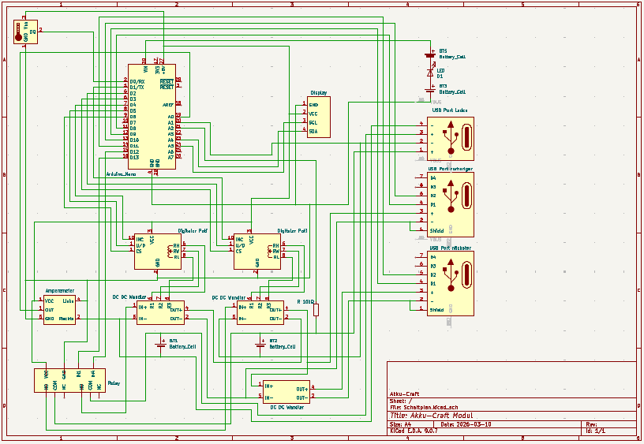

# Akku-Craft Schematics

Here you can find the schematics and PCB layouts for the Akku-Craft project.

## Overview

The project contains KiCad files for the development of battery management and monitoring systems. The main schematic as well as a separate current sensor are included.



## Project Structure


```

Schaltplan/
├── Schaltplan.kicad_sch      # Main schematic
├── Schaltplan.kicad_pcb      # PCB layout
├── Schaltplan.kicad_pro      # KiCad project file
├── sensor_corrente.kicad_sch # Current sensor schematic
├── sensor_corrente.kicad_pcb # Current sensor PCB layout
└── Schaltplan-backups/       # Automatic backups

```

## Software

The project was created with KiCad. Version 9.x or higher is recommended.

Download: https://www.kicad.org/

## Installation

Clone the repository and open the file `schematics/Schaltplan.kicad_pro` in KiCad.

## Components

The main schematic is located in `Schaltplan.kicad_sch`.

## Workflow

Typical workflow for changes:

1. Open and edit the schematic in KiCad
2. Update the PCB layout accordingly
3. Perform a Design Rule Check (DRC)
4. Export Gerber files for manufacturing

## Backups

KiCad automatically creates backups in the `Schaltplan-backups/` folder. The ZIP files contain snapshots of the project at various points in time.


## License

This project is licensed under the CC BY-NC-ND License – see the [LICENSE](LICENSE) file for details.
